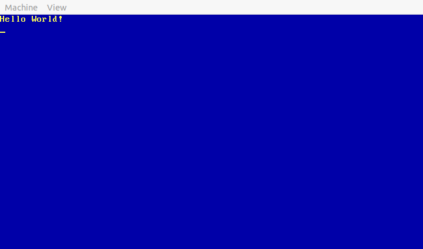
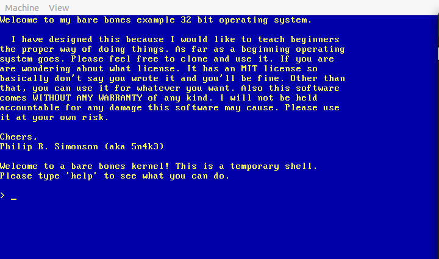
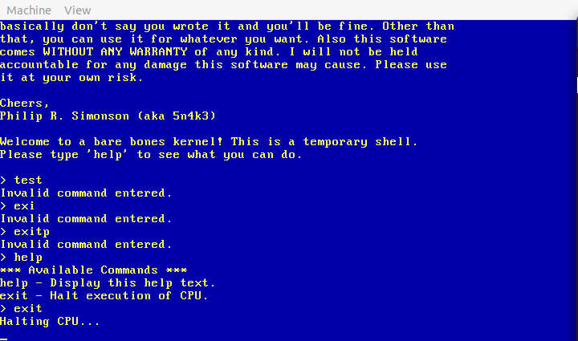

## Small Two Stage Bootloader and C Kernel

I know a lot about 16 real mode and boot sectors but not everything about it. I
am doing this small project to learn even more, after all knowledge is power. This
project will show you how to write a two stage boot loader written in NASM (Net-wide Assembler), also with a simple kernel
written in pure C.

### Screen Shots

### Build and Run Instructions

 - Install required tools for Debian based distros below.

		sudo apt install -y build-essential nasm qemu-system wodim

 - How to compile?

		1 - make run (builds and runs in qemu).
		2 - make debug (builds and runs in qemu with gdb debugging).
		3 - make disk - builds floppy.img (you can write that to a floppy).
		4 - make cdrom - builds cdrom.iso (you can write this to cdrom).

 - How to write to disk?

		1 - Floppy, make disk && sudo dd if=floppy.img of=/dev/fd0 bs=512 count=2880 conv=sync status=progress
		2 - CDROM, an ISO image ready to burn.
			2a - cdrecord -scanbus (to see what device id).
			2b - cdrecord dev=<devid> speed=12 -pad -v -eject boot32-barebones.iso
			2c - NOTE: <devid> = #,#,# from cdrecord -scanbus (2a).

### TODO

 - [x] - First stage boot loader (for loading second stage).
 - [x] - Second stage boot loader (for loading kernel).
 - [x] - Simple starter kernel written in C.
 - [x] - Add my simple file system (list of LBA starts and count of sectors).
 - [x] - Fix kernel not loading again.
 - [x] - Fix ISRs and IRQs so they work (they cause a kernel panic).
 - [x] - Fix breakpoint exception (shouldn't be happening).
 - [x] - Fix keyboard map.
 - [x] - Fix keyboard handler, it types multiples and '9' is enter for some reason.
 - [x] - Add PIT timer handler.
 - [x] - Add keyboard input handler.
 - [x] - Basic shell.
 - [x] - Fix buggy backspace issue.

### Known Issues

 - (Fixed) Backspace is a little buggy at the moment.\
    But doesn't hinder operating system at all.

### Developer

 - Philip R. Simonson (aka 5n4k3)
 - With help from people on osdev.org, Michael Petch, Octocontrabass, and more.

### License

 - MIT License (see LICENSE.md for details)
